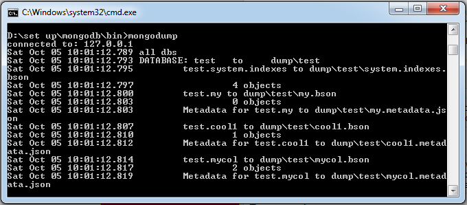
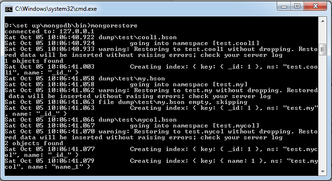

## MongoDB 数据转储  

为了在 MongoDB 中创建数据库备份，需要使用 **mongodump** 命令。该命令会将服务器上的所有数据都转储到 dump 目录中。你可以使用很多选项来限制转储的数据量，或者创建远程服务器备份。  

### 格式  

**mongodump** 命令的基本语法格式为：  

`>mongodump`  

### 范例  

开启 mongod 服务器。假设 mongod 服务器运行在 localhost 上，端口为 27017。在命令行上输入命令，在 MongoDB 实例的 bin 目录下输入 **mongodump** 命令。   

假设 mycol 集合包含如下数据：  

`>mongodump`  

上述命令会连接在 127.0.0.1 运行的服务器（端口为 27017），将所有数据备份到 **/bin/dump** 上。命令输出结果如下图所示：  

  

mongodump 命令其实包含很多选项。   

|语法格式|描述|范例|
|---|---|---|  
|`mongodump --host HOST_NAME --port PORT_NUMBER`|该命令将指定 mongod 实例上的所有数据库都进行了备份|`mongodump --host tutorialspoint.com --port 27017`|  
|`mongodump --dbpath DB_PATH --out BACKUP_DIRECTORY`|-|`mongodump --dbpath /data/db/ --out /data/backup/`|  
|`mongodump --collection COLLECTION --db DB_NAME`|该命令只备份那些指定路径上的指定数据库|`mongodump --collection mycol --db test`|

## 重新恢复数据  

恢复备份数据使用 **mongorestore** 命令，该命令将备份目录中的所有数据给予恢复。  

### 语法格式   

**mongorestore** 命令的基本语法格式为：  

`> mongorestore`   

该命令输入结果如下图所示：  

