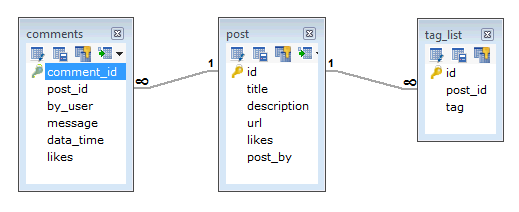

MongoDB 中的数据模式非常灵活。同一集合中的文档不需要具有同一字段或结构，集合文档的公用字段可能包含不同类型的数据。   

## 设计 MongDB 模式时应注意的问题  

- 根据用户需求来设计模式。  
- 如果想一起使用对象，请将这些对象合并到一个文档中，否则要将它们分开（但是要确保不需要连接）。  
- 经常复制数据（但要有一定限度），因为与计算时间相比，硬盘空间显得非常便宜。  
- 在写入时进行连接，而不能在读取时连接。  
- 针对经常发生的用例来设计模式。  
- 在模式中实现复杂的聚合。  

## 范例  

假使一个客户需要为他的博客站点设计一个数据库，让我们来看看 RDBMS 与 MongoDB 在模式设计上的差异。网站需求如下所示：  

- 每篇博客都具有唯一的标题、描述以及 URL。   
- 每篇博客都具有一个或多个标签。  
- 每篇博客都具有发表者的名称，以及喜欢
- 每篇博客都有用户的评论，用户名、消息、日期时间以及评论的喜欢度。  
- 每篇博客都可以有 0 个或多个评论。   

在 RDBMS 中，设计一个能够满足上述需求的数据库模式至少需要 3 个表。如下图所示。  

  

在 MongoDB 中，设计出来的模式却只有一个集合 post，其结构如下：    

```
{
   _id: POST_ID
   title: TITLE_OF_POST, 
   description: POST_DESCRIPTION,
   by: POST_BY,
   url: URL_OF_POST,
   tags: [TAG1, TAG2, TAG3],
   likes: TOTAL_LIKES, 
   comments: [	
      {
         user:'COMMENT_BY',
         message: TEXT,
         dateCreated: DATE_TIME,
         like: LIKES 
      },
      {
         user:'COMMENT_BY',
         message: TEXT,
         dateCreated: DATE_TIME,
         like: LIKES
      }
   ]
}   
```  

虽然只是展示数据，在 RDBMS 中需要连接三张表，而在 MongoDB 中则只需要一个集合。
