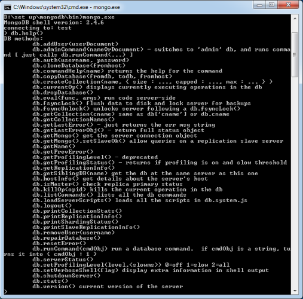
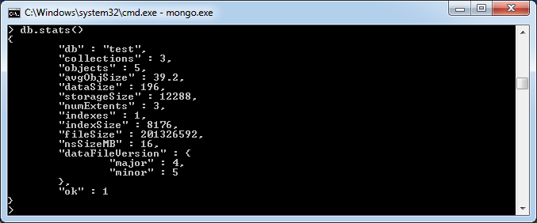

## 在 Windows 上安装 MongoDB  

在 Windows 上安装 MongoDB，先要从 [http://www.mongodb.org/downloads](http://www.mongodb.org/downloads) 上下载 MongoDB 的最新版本。根据你的 Windows 版本选择正确的 MongoDB 版本。要想知道你的 Windows 版本，在命令行中输入下列指令：  

```
C:\>wmic os get osarchitecture
OSArchitecture
64-bit
C:\>

```

32 位版本的 MongoDB 只支持 2G 以下的数据库，只适用于测试及评估。   

现在将下载的文件解压至 c:\ 或其他位置。解压后的文件夹名称应该是 mongodb-win32-i386-[version] 或 mongodb-win32-x86_64-[version]。这里的 [version] 代表下载的 MongoDB 版本号。  

打开命令行，运行下列命令：  

```
C:\>move mongodb-win64-* mongodb
1 dir(s) moved.
C:\>
```

假如将文件解压缩至其他位置，可以采用 **cd FOOLDER/DIR** 找到指定路径，然后运行上面的代码。  

MongoDB 需要一个 data 文件夹来保存文件。默认的 MongoDB data 目录位于 c:\data\db。所以需要用命令行来创建这个文件夹。执行下列命令即可：  

```  
C:\>md data
C:\md data\db
```

如果已经把 MongoDB 安装在其他位置，则需要在 mongod.exe 设置 dbpath 路径来指定 **\data\db** 的替换路径。如下面代码所示。   


在命令行中，导航至 bin 目录，进入 MongoDB 安装文件夹。假设我的安装文件夹是：**D:\set up\mongodb**。  

```  
C:\Users\XYZ>d:
D:\>cd "set up"
D:\set up>cd mongodb
D:\set up\mongodb>cd bin
D:\set up\mongodb\bin>mongod.exe --dbpath "d:\set up\mongodb\data" 

```

控制台输出会显示 **waiting for connections** 消息，这表示 mongod.exe 进程已经成功运行。    

要想运行 mongodb，需要输入下列命令：   

```    
D:\set up\mongodb\bin>mongo.exe
MongoDB shell version: 2.4.6
connecting to: test
>db.test.save( { a: 1 } )
>db.test.find()
{ "_id" : ObjectId(5879b0f65a56a454), "a" : 1 }
>
```  

运行显示 mongodb 已安装并成功运行。下次运行 mongodb 时，只需输入以下命令即可：   

```
D:\set up\mongodb\bin>mongod.exe --dbpath "d:\set up\mongodb\data" 
D:\set up\mongodb\bin>mongo.exe    
```

## 在 Ubuntu 上安装 MongoDB  

运行下列命令，导入 MongoDB 公开 GPG 键：   

`sudo apt-key adv --keyserver hkp://keyserver.ubuntu.com:80 --recv 7F0CEB10`  

使用下列命令，创建一个 /etc/apt/sources.list.d/mongodb.list 文件。   

`echo 'deb http://downloads-distro.mongodb.org/repo/ubuntu-upstart dist 10gen' | sudo tee /etc/apt/sources.list.d/mongodb.list`  

运行下列命令，更新存储库：  

`sudo apt-get update`  

然后利用下列命令安装 MongoDB：  

`apt-get install mongodb-10gen=2.2.3`  

在上面的命令中，安装的 2.2.3 版本正是 MongoDB 的当前版本。记住一定要及时更新至最新的版本。至此，MongoDB 的安装就成功了。  

启动 MongoDB：  

`sudo service mongodb start`  

停止 MongoDB：  

`sudo service mongodb stop`  

重启 MongoDB：  

`sudo service mongodb restart`  

使用 mongodb 时，输入下列命令即可：  

`mongo`  

这将连接到运行中的 mongod 实例中。  

## MongoDB 帮助  

要想获取命令列表，在 mongodb 客户端中输入 **db.help()**，将显示如下图所示的命令列表：    

  

## MongoDB 统计信息  

要想获取 MongoDB 服务器的统计信息，在 mongodb 客户端中输入 **db.stat()**，随即将显示数据库名称、集合数目，以及数据库中的文档等信息。如图所示：  




